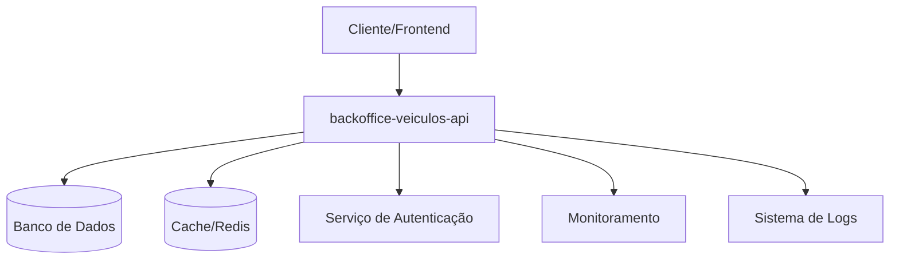

# Arquitetura do Sistema Backoffice Veículos

## Visão Geral

O sistema Backoffice Veículos é uma solução backend desenvolvida pelo Squad Backoffice para gerenciamento de operações administrativas relacionadas a veículos. A arquitetura é baseada em uma API RESTful que fornece serviços para operações de backoffice.

## Diagrama de Componentes



### Componentes

#### backoffice-veiculos-api
- **Tipo:** API REST
- **Repositório:** https://github.com/emingues-xx/backoffice-veiculos-api.git
- **Responsabilidade:** Gerenciamento de operações de backoffice relacionadas a veículos
- **Função:** API principal que expõe endpoints para operações CRUD e regras de negócio

## Fluxo de Dados

### Fluxo Principal de Requisição

1. **Cliente → API**: Requisição HTTP com autenticação
2. **API → Autenticação**: Validação de credenciais e permissões
3. **API → Cache**: Verificação de dados em cache
4. **API → Banco de Dados**: Consulta/persistência de dados quando necessário
5. **API → Cliente**: Resposta com dados processados

### Fluxo de Dados Detalhado

```
┌─────────┐     ┌──────────────────────┐     ┌──────────┐
│ Cliente │────▶│ backoffice-veiculos  │────▶│ Database │
└─────────┘     │       -api           │     └──────────┘
                └──────────────────────┘
                         │    ▲
                         │    │
                         ▼    │
                    ┌─────────────┐
                    │   Cache     │
                    └─────────────┘
```

## Tecnologias Utilizadas

### Backend
- **Linguagem:** Node.js
- **Framework:** Express/Fastify
- **Runtime:** TypeScript
- **ORM:** TypeORM/Sequelize

### Banco de Dados
- **Principal:** PostgreSQL
- **Cache:** Redis

### Infraestrutura
- **Containerização:** Docker
- **Orquestração:** Kubernetes
- **CI/CD:** GitHub Actions
- **Cloud:** AWS

### Observabilidade
- **Logs:** ELK Stack
- **Métricas:** Prometheus + Grafana
- **APM:** New Relic
- **Alerts:** PagerDuty

## Padrões Arquiteturais

### Arquitetura em Camadas

```
┌────────────────────────────────┐
│   Controllers/Routes Layer     │  ← Recebe requisições HTTP
├────────────────────────────────┤
│   Service/Business Layer       │  ← Lógica de negócio
├────────────────────────────────┤
│   Repository/Data Layer        │  ← Acesso a dados
├────────────────────────────────┤
│   Database/External Services   │  ← Persistência
└────────────────────────────────┘
```

### Padrões Aplicados

- **RESTful API**: Endpoints seguem convenções REST
- **Repository Pattern**: Abstração de acesso a dados
- **Dependency Injection**: Inversão de controle e desacoplamento
- **DTO (Data Transfer Objects)**: Transferência de dados entre camadas
- **Error Handling**: Tratamento centralizado de exceções
- **Validation**: Validação de entrada em todas as camadas
- **BFF (Backend for Frontend)**: Agregação de dados específica por contexto

## Considerações de Segurança

### Autenticação e Autorização
- **JWT (JSON Web Tokens)**: Autenticação stateless
- **RBAC (Role-Based Access Control)**: Controle de acesso baseado em papéis
- **Multi-factor Authentication**: Segurança adicional para operações críticas
- **VPN/IP Whitelist**: Restrição de acesso por rede

### Proteção de Dados
- **Criptografia em Trânsito**: TLS/SSL em todas as comunicações HTTPS
- **Criptografia em Repouso**: Dados sensíveis criptografados no banco
- **Sanitização de Entrada**: Prevenção contra SQL Injection e XSS
- **Rate Limiting**: Proteção contra abuso de API por IP
- **CSP Headers**: Content Security Policy implementado

### Compliance
- **LGPD**: Adequação à Lei Geral de Proteção de Dados
  - Data anonymization para analytics
  - Right to be forgotten implementation
  - Consent management system
- **Auditoria**: Logs de todas as operações sensíveis (immutable audit trail)
- **Backup**: Estratégia de backup e recuperação de desastres
  - Automated daily backups
  - Point-in-time recovery (7 dias)
  - Cross-region replication

## Estratégia de Deploy

### Ambientes

```
Development → Staging → Production
     ↓           ↓          ↓
   Local      Homolog    Produção
```

### Pipeline CI/CD

1. **Build**
   - Compilação do código TypeScript
   - Execução de testes unitários
   - Análise de código estático (ESLint, SonarQube)
   - Code coverage report

2. **Test**
   - Testes de integração
   - Testes de contrato
   - Testes de segurança (SAST/DAST)
   - Performance testing

3. **Deploy**
   - Build de imagem Docker
   - Push para registry (ECR/Docker Hub)
   - Deploy em ambiente de staging
   - Testes de smoke
   - Deploy em produção (blue-green/canary)

### Estratégia de Release

- **Blue-Green Deployment**: Minimiza downtime durante deploys
- **Canary Release**: Deploy gradual com monitoramento (10% → 50% → 100%)
- **Rollback Automático**: Reversão automática em caso de falhas críticas
- **Feature Flags**: Habilitar/desabilitar funcionalidades sem deploy

## Monitoramento

### Métricas Principais

#### Performance
- **Tempo de resposta da API**: < 500ms (P95)
- **Throughput**: Requisições por segundo
- **Taxa de erro**: 4xx < 5%, 5xx < 1%
- **Database query time**: < 100ms para queries simples

#### Infraestrutura
- **Uso de CPU**: < 70% em operação normal
- **Uso de memória**: < 80% em operação normal
- **Latência de banco de dados**: < 100ms
- **Disponibilidade dos serviços**: 99.9% uptime (SLA)

#### Negócio
- **Volume de operações por endpoint**
- **Taxa de sucesso de operações críticas**: > 99%
- **Tempo de processamento por tipo de operação**
- **Concurrent users**: Usuários simultâneos

### Service Level Objectives (SLO)

- **SLI**: Service Level Indicators definidos por sistema
- **SLO**: Availability > 99.9%, Latency P95 < 500ms
- **SLA**: Service Level Agreements com usuários internos

### Alertas

#### Críticos
- Indisponibilidade do serviço
- Taxa de erro > 5%
- Database connection pool exhausted
- Memory leak detection

#### Warnings
- Latência alta (> 1s P95)
- Uso de recursos > 80%
- Cache hit rate < 70%
- Slow queries (> 1s)

#### Info
- Deploy concluído
- Backup realizado com sucesso
- Auto-scaling triggered
- Configuration changed

### Health Checks

- **Liveness Probe**: Verifica se a aplicação está rodando
- **Readiness Probe**: Verifica se a aplicação está pronta para receber tráfego
- **Startup Probe**: Verifica se a aplicação iniciou corretamente
- **Dependency Health**: Verifica conectividade com database, cache, APIs externas

## Escalabilidade

### Horizontal Scaling
- **Auto-scaling**: Baseado em métricas de CPU/memória/requisições
- **Load Balancer**: Distribuição de requisições entre instâncias
- **Múltiplas Instâncias**: Mínimo de 2 réplicas em produção
- **Database Read Replicas**: Para queries read-heavy

### Otimizações
- **Cache de queries frequentes**: Redis com TTL apropriado (1-5 min)
- **Índices otimizados**: No banco de dados por padrão de acesso
- **Connection Pooling**: Database connection pool otimizado
- **Compression**: Gzip/Brotli para respostas HTTP
- **Pagination**: Limit/offset para queries grandes
- **Query optimization**: N+1 prevention, eager loading

### Performance Targets
- **API Response Time**: < 500ms para operações CRUD
- **Database Queries**: < 100ms para queries simples
- **Cache Hit Rate**: > 70% para dados frequentes
- **Concurrent Requests**: Suporte para > 1000 req/s

## Integração com Outros Sistemas

### Sistemas Relacionados
```
┌─────────────────┐    ┌─────────────────┐
│   Vitrine       │    │   Backoffice    │
│   (Público)     │    │   (Interno)     │
└─────────────────┘    └─────────────────┘
         │                       │
         ▼                       ▼
┌─────────────────┐    ┌─────────────────┐
│ vitrine-api     │    │ backoffice-api  │
└─────────────────┘    └─────────────────┘
         │                       │
         └───────────┬───────────┘
                     ▼
         ┌─────────────────┐
         │ Shared Database │
         │   PostgreSQL    │
         └─────────────────┘
```

### Shared Database com Context Boundaries
Embora compartilhem o banco de dados PostgreSQL, cada sistema tem:
- **Views específicas** para suas necessidades
- **Stored procedures otimizadas** por contexto
- **Índices customizados** por padrão de acesso
- **Context boundaries** bem definidos

### Separação de Contextos
- **Vitrine**: Read-heavy, otimizado para consultas rápidas e SEO
- **Backoffice**: Write-heavy, otimizado para operações complexas e auditoria

## Documentação Relacionada

- [Componente: backoffice-veiculos-api](../components/backoffice-veiculos-api/index.md)
- [API Reference](../components/backoffice-veiculos-api/api-reference.md)
- [Guia de Instalação](../components/backoffice-veiculos-api/installation.md)
- [ADRs (Architecture Decision Records)](./adrs/)
