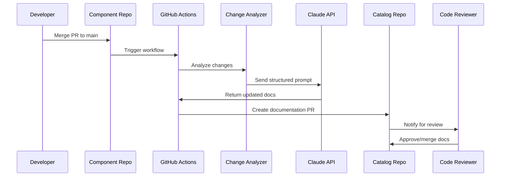

# Automação de Documentação - ecommerce-veiculos-pipelines

Sistema inteligente de atualização automática de documentação usando Claude API.

## Visão Geral

A automação de documentação é um sistema que monitora mudanças em todos os componentes do E-commerce de Veículos e atualiza automaticamente a documentação técnica usando inteligência artificial.

## Como Funciona

### Fluxo Completo


### Componentes do Sistema

#### 1. Change Detection
```yaml
# Workflow trigger
on:
  pull_request:
    types: [closed]
    branches: [main]

jobs:
  update-docs:
    if: github.event.pull_request.merged == true
```

#### 2. Component Recognition
```bash
# Branch pattern matching
if [[ $BRANCH_NAME =~ (vitrine-veiculos-web|vitrine-veiculos-api|...) ]]; then
    DETECTED_COMPONENT="${BASH_REMATCH[1]}"
fi
```

#### 3. Change Analysis
```python
def analyze_changes(repo_path, pr_info):
    analysis = {
        "change_types": detect_change_types(pr_info),
        "files_changed": get_changed_files(repo_path),
        "package_changes": analyze_package_json(repo_path),
        "git_commits": get_recent_commits(repo_path),
        "architectural_changes": detect_arch_changes(repo_path)
    }
    return analysis
```

## Tipos de Mudanças Detectadas

### Conventional Commits
| Prefix | Tipo de Mudança | Ação na Documentação |
|--------|-----------------|----------------------|
| `feat:` | Nova feature | Atualiza docs da feature + overview |
| `fix:` | Correção de bug | Atualiza troubleshooting se necessário |
| `refactor:` | Refatoração | Atualiza arquitetura se significativa |
| `perf:` | Performance | Atualiza métricas e benchmarks |
| `docs:` | Documentação | Skip (mudança já é doc) |

### Análise de Arquivos
| Padrão de Arquivo | Mudança Detectada | Documentação Afetada |
|-------------------|-------------------|---------------------|
| `*.api.ts` | API changes | `api.md` |
| `package.json` | Dependencies | `index.md`, `setup.md` |
| `Dockerfile` | Infrastructure | `architecture.md` |
| `*.config.*` | Configuration | `setup.md` |
| `src/types/*` | Type definitions | `api.md`, `architecture.md` |

### Mudanças Arquiteturais
```python
def detect_architectural_changes(repo_path):
    arch_indicators = [
        'src/config/',
        'src/lib/',
        'dockerfile',
        'docker-compose.yml',
        'next.config.js',
        'vite.config.ts'
    ]
    
    changes = []
    for indicator in arch_indicators:
        if has_changes(repo_path, indicator):
            changes.append(f"Architectural change in {indicator}")
    
    return changes
```

## Prompt Engineering

### Template Dinâmico
O sistema usa um template que se adapta às mudanças detectadas:

```markdown
## Contexto
Component: {component_name}
PR: {pr_title}
Mudanças: {change_types_detected}

## Análise Técnica
- Versão: {package_version}
- Dependências alteradas: {dependencies_changed}
- Arquivos modificados: {files_changed}
- Commits recentes: {recent_commits}

## Solicitação
Analise estas mudanças e atualize a documentação...
```

### Variáveis Contextuais
```python
def format_prompt(template, analysis):
    return template.format(
        component_name=analysis["component"],
        pr_title=analysis["pr_title"],
        change_types_detected=format_change_types(analysis["change_types"]),
        package_version=analysis["package_info"]["version"],
        dependencies_changed=analysis["package_info"]["dependencies"],
        files_changed=analysis["git_changes"]["files_changed"],
        recent_commits=analysis["git_changes"]["recent_commits"]
    )
```

## Integração Claude API

### Configuração da API
```python
client = anthropic.Anthropic(api_key=os.getenv('ANTHROPIC_API_KEY'))

response = client.messages.create(
    model="claude-3-5-sonnet-20241022",
    max_tokens=8000,
    temperature=0.1,  # Low temperature for consistent docs
    system="You are Claude Code, a documentation expert...",
    messages=[{"role": "user", "content": formatted_prompt}]
)
```

### Parsing de Resposta
```python
def parse_claude_response(response):
    # Extract file updates from Claude's response
    updates = {
        "files_to_update": [],
        "new_files": [],
        "summary": ""
    }
    
    # Pattern matching for file paths and content
    file_pattern = r'docs/components/([^/]+)/([^/]+\.md)'
    matches = re.findall(file_pattern, response)
    
    for match in matches:
        component, filename = match
        content = extract_content_for_file(response, filename)
        updates["files_to_update"].append({
            "path": f"docs/components/{component}/{filename}",
            "content": content
        })
    
    return updates
```

## Tipos de Documentação Atualizados

### Component Documentation
```
docs/components/{component}/
├── index.md           # Overview, features, installation
├── architecture.md    # Technical architecture
├── api.md            # API endpoints (if applicable)
└── setup.md          # Setup and configuration
```

### System Documentation
```
docs/systems/{system}/
├── index.md              # System overview
├── feature-*.md         # Feature documentation
└── arquitetura.md       # System architecture
```

### Architecture Documentation
```
docs/architecture/
├── overview.md          # High-level architecture
└── adrs/
    └── adr-xxx-*.md    # Architecture Decision Records
```

## Critérios de Atualização

### SEMPRE Atualizar
- ✅ Mudanças em APIs/endpoints
- ✅ Novas dependências
- ✅ Alterações de configuração
- ✅ Mudanças arquiteturais significativas
- ✅ Novas features

### CONSIDERAR Atualizar
- ⚠️ Refatorações internas
- ⚠️ Bug fixes que não afetam interface
- ⚠️ Melhorias de performance
- ⚠️ Atualizações de testes

### CRIAR ADR Para
- 📋 Mudança de tecnologia/framework
- 📋 Decisão arquitetural significativa
- 📋 Breaking changes
- 📋 Mudanças que afetam múltiplos components

## Quality Assurance

### Validações Automáticas
```python
def validate_documentation_updates(updates):
    for file_update in updates["files_to_update"]:
        # Check markdown syntax
        validate_markdown_syntax(file_update["content"])
        
        # Validate internal links
        validate_internal_links(file_update["content"])
        
        # Check for required sections
        validate_required_sections(file_update["path"], file_update["content"])
        
        # Consistency checks
        validate_consistency(file_update["content"])
```

### Human Review Process
1. **Automated PR Creation**: Sistema cria PR com mudanças
2. **Review Assignment**: Assign para tech writer + component owner
3. **Quality Checks**: Validação automática de sintaxe e links
4. **Human Approval**: Review manual antes do merge
5. **Feedback Loop**: Melhorias baseadas no feedback

## Monitoramento e Métricas

### Métricas de Automação
```yaml
# Métricas coletadas
automation_metrics:
  prs_processed: 
    description: "PRs processados pelo sistema"
    type: counter
  
  documentation_updates:
    description: "Documentos atualizados automaticamente"
    type: counter
    
  claude_api_calls:
    description: "Chamadas para Claude API"
    type: counter
    
  success_rate:
    description: "Taxa de sucesso das atualizações"
    type: gauge
```

### Alertas Configurados
- ❌ **Claude API Error**: Falha na API
- ⚠️ **High Rejection Rate**: Muitos PRs rejeitados
- 📊 **Usage Spike**: Uso elevado da API
- 🔄 **Workflow Failure**: Falha no GitHub Actions

## Configuração e Deployment

### Secrets Necessários
```bash
# GitHub Repository Secrets
ANTHROPIC_API_KEY=sk-ant-...           # Claude API key
GITHUB_TOKEN=${{ secrets.GITHUB_TOKEN }} # GitHub access
```

### Workflow Configuration
```yaml
# .github/workflows/update-docs.yml
name: Update Documentation
on:
  pull_request:
    types: [closed]
    branches: [main]

env:
  ANTHROPIC_API_KEY: ${{ secrets.ANTHROPIC_API_KEY }}
```

### Components Monitorados
```yaml
monitored_components:
  - vitrine-veiculos-web
  - vitrine-veiculos-api
  - vitrine-veiculos-bff
  - backoffice-veiculos-web
  - backoffice-veiculos-api
  - backoffice-veiculos-bff
  - ecommerce-veiculos-shared
  - ecommerce-veiculos-ui-components
  - ecommerce-veiculos-pipelines
```

## Troubleshooting

### Problemas Comuns

#### Component Não Detectado
```bash
# Verificar pattern da branch
echo "Branch: feature/vitrine-veiculos-web-nova-funcionalidade"
# ✅ Correto - contém nome do component

echo "Branch: feature/nova-funcionalidade"  
# ❌ Incorreto - não contém nome do component
```

#### Claude API Errors
```python
# Rate limiting
if "rate_limit" in error_message:
    time.sleep(60)  # Wait 1 minute
    retry_api_call()

# Invalid prompt
if "prompt_too_long" in error_message:
    truncate_prompt()
    retry_api_call()
```

#### Documentation Quality Issues
```markdown
# Checklist de qualidade
- [ ] Markdown syntax válido
- [ ] Links internos funcionais
- [ ] Seções obrigatórias presentes
- [ ] Consistência com docs existentes
- [ ] Exemplos de código válidos
```

## Roadmap de Melhorias

### Próximas Features
- [ ] **Multi-language Support**: Documentação em PT/EN
- [ ] **Visual Diff Preview**: Preview das mudanças
- [ ] **Auto-merge**: Merge automático para mudanças simples
- [ ] **Learning System**: Melhoria baseada em feedback
- [ ] **Integration Tests**: Validação de exemplos de código

### Otimizações
- [ ] **Prompt Optimization**: Melhorar qualidade das respostas
- [ ] **Cost Reduction**: Reduzir tokens por chamada
- [ ] **Performance**: Paralelizar processamento
- [ ] **Reliability**: Retry logic mais robusto