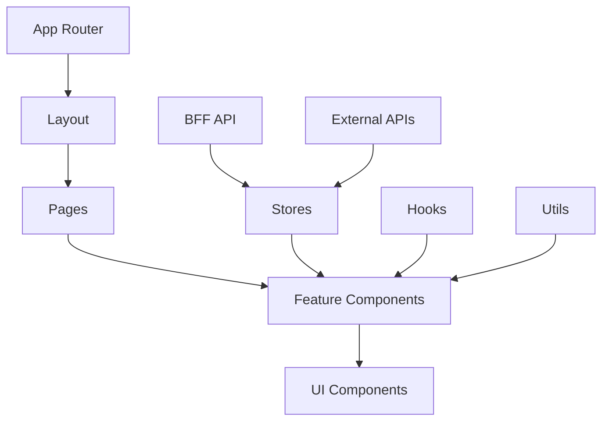
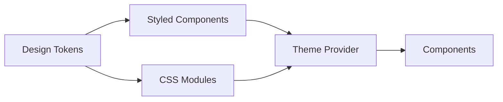
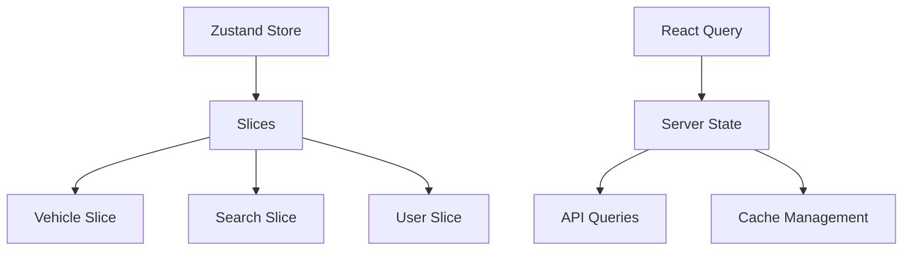
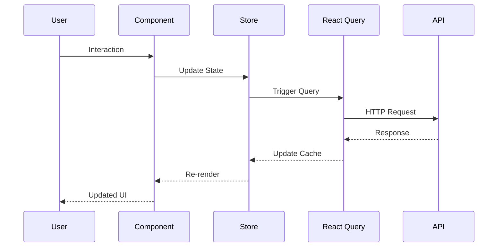
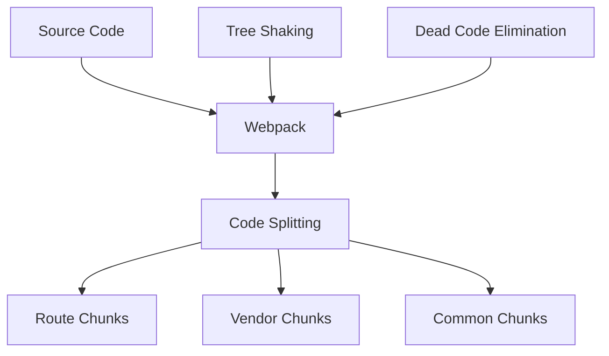
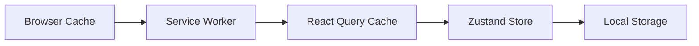
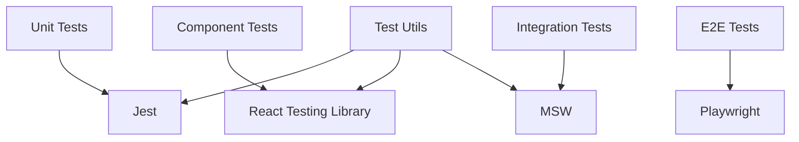
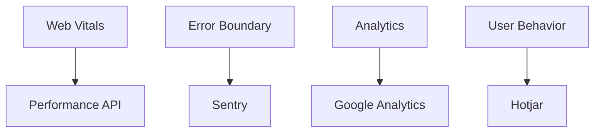
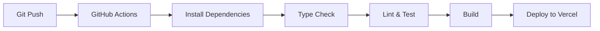

# Arquitetura - vitrine-veiculos-web

Arquitetura detalhada do frontend da vitrine de veículos.

## Visão Geral

Aplicação Next.js 14 otimizada para performance e SEO, seguindo princípios de component-driven development e state management eficiente.

## Arquitetura de Componentes



## Stack Técnico

### Core Framework
- **Next.js 14**: App Router para roteamento moderno
- **React 18**: Concurrent features e Suspense
- **TypeScript 5**: Type safety completo

### Styling e UI


**Approach**:
- Design tokens centralizados
- Styled Components para componentes dinâmicos
- CSS Modules para estilos estáticos
- Theme switching (light/dark)

### State Management



**Estratégia**:
- **Zustand**: Estado global da aplicação
- **React Query**: Estado do servidor e cache
- **React Hook Form**: Estado de formulários
- **Local Storage**: Persistência de preferências

## Estrutura de Pastas

```
src/
├── app/
│   ├── (marketing)/           # Grupo: páginas marketing
│   │   ├── page.tsx          # Homepage
│   │   └── sobre/            # Página sobre
│   ├── veiculos/             # Área de veículos
│   │   ├── page.tsx          # Listagem
│   │   ├── [slug]/           # Detalhes do veículo
│   │   └── buscar/           # Busca avançada
│   ├── layout.tsx            # Layout raiz
│   └── globals.css           # Estilos globais
├── components/
│   ├── ui/                   # Componentes base
│   │   ├── Button/
│   │   ├── Input/
│   │   └── Modal/
│   └── features/             # Componentes de negócio
│       ├── VehicleCard/
│       ├── SearchFilters/
│       └── VehicleGallery/
├── hooks/                    # Custom hooks
├── stores/                   # Zustand stores
├── lib/                      # Configurações
└── types/                    # TypeScript types
```

## Routing Strategy

### App Router (Next.js 14)
```mermaid
graph TD
    A[/] --> B[Homepage]
    C[/veiculos] --> D[Vehicle List]
    E[/veiculos/[slug]] --> F[Vehicle Details]
    G[/buscar] --> H[Advanced Search]
    
    I[Middleware] --> J[Auth Check]
    I --> K[Geo Location]
    I --> L[A/B Testing]
```

**Características**:
- Server Components por padrão
- Client Components apenas quando necessário
- Streaming para carregamento progressivo
- Suspense boundaries para fallbacks

## Data Flow



## Performance Architecture

### Bundle Optimization


### Loading Strategy
- **Critical CSS**: Inline para above-the-fold
- **Image Optimization**: Next.js Image component
- **Prefetching**: Automatic para links visíveis
- **Service Worker**: Cache de assets

### Caching Layers


## Security

### Client-Side Security
- **Content Security Policy**: Configurado no Next.js
- **XSS Protection**: Sanitização automática do React
- **Input Validation**: Zod schemas
- **Environment Variables**: Segregação public/private

### API Security
```typescript
// Exemplo de interceptor Axios
axios.interceptors.request.use((config) => {
  // Rate limiting headers
  config.headers['X-RateLimit-User'] = getUserId();
  
  // CSRF protection
  config.headers['X-CSRF-Token'] = getCSRFToken();
  
  return config;
});
```

## Testing Architecture



### Testing Strategy
- **Unit**: Lógica de negócio e utilitários
- **Component**: Comportamento dos componentes
- **Integration**: Fluxos completos com API mock
- **E2E**: Jornadas críticas do usuário

## Monitoring

### Client-Side Monitoring


### Métricas Coletadas
- **Performance**: Core Web Vitals
- **Errors**: JavaScript errors e crashes
- **Usage**: Page views, interactions
- **Business**: Conversion funnels

## Deployment

### Build Process


### Environments
- **Development**: Local com hot reload
- **Staging**: Preview deployments (Vercel)
- **Production**: Main branch auto-deploy