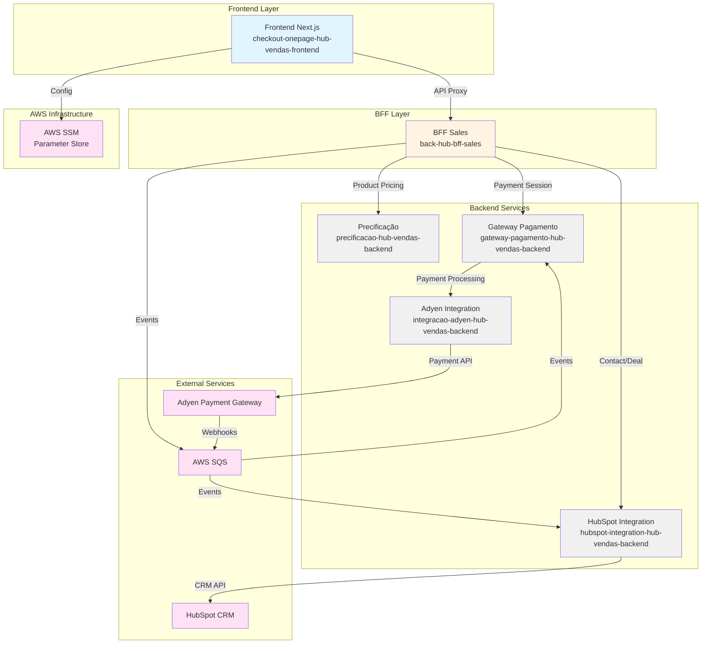
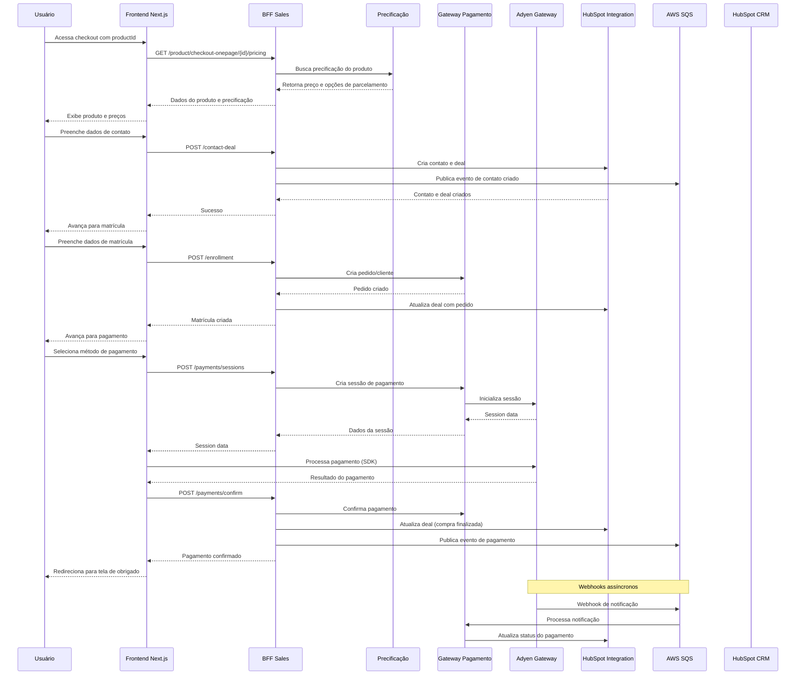
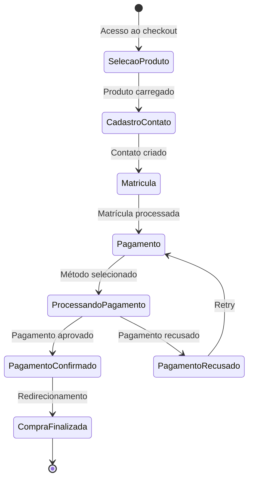

# Arquitetura do Sistema Checkout Onepage

## Visão Geral

O Checkout Onepage é uma solução frontend que integra múltiplos serviços para proporcionar uma experiência fluida de matrícula e pagamento para instituições de ensino. O sistema gerencia todo o fluxo desde a seleção do produto até a finalização do pagamento.

## Diagrama de Arquitetura

## Fluxo de Dados Detalhado

## Componentes Principais

### Frontend (Next.js)
- **Framework**: Next.js 15.2.4
- **Linguagem**: TypeScript
- **UI**: Material UI v7 + Styled Components
- **State Management**: React Context + TanStack React Query
- **Formulários**: React Hook Form + Zod
- **Payment SDK**: Adyen Web SDK

### BFF (Backend For Frontend)
- **Framework**: NestJS
- **Função**: Orquestração de chamadas para múltiplos serviços
- **Endpoints Principais**:
  - `/product/checkout-onepage/{id}/pricing` - Precificação
  - `/contact-deal` - Criação de contato e deal
  - `/enrollment` - Processamento de matrícula
  - `/payments/sessions` - Criação de sessão de pagamento
  - `/payments/confirm` - Confirmação de pagamento

### Serviços Backend

#### Precificação
- Calcula preços do produto
- Aplica cupons e descontos
- Retorna opções de parcelamento

#### Gateway de Pagamento
- Gerencia pedidos e clientes
- Integra com Adyen
- Processa webhooks de pagamento

#### HubSpot Integration
- Cria e atualiza contatos
- Gerencia deals (negócios)
- Sincroniza estágios de pedido

#### Adyen Integration
- Processa pagamentos
- Gerencia sessões de pagamento
- Processa notificações assíncronas

## Fluxo de Jornada do Usuário

## Tecnologias e Integrações

### Frontend
- Next.js 15.2.4
- TypeScript
- Material UI v7
- Styled Components
- TanStack React Query
- React Hook Form + Zod
- Adyen Web SDK
- AWS SDK (SSM)

### Backend
- NestJS
- AWS SQS
- AWS SSM Parameter Store

### Integrações Externas
- **Adyen**: Gateway de pagamento (cartão, PIX, boleto)
- **HubSpot**: CRM para gestão de contatos e deals
- **AWS SQS**: Fila de mensagens para eventos assíncronos
- **AWS SSM**: Armazenamento de parâmetros de configuração

## Padrões Arquiteturais

### BFF Pattern
O Backend For Frontend (BFF) atua como uma camada de orquestração, agregando chamadas para múltiplos serviços backend e fornecendo uma API unificada otimizada para o frontend.

### Event-Driven Architecture
Eventos assíncronos são publicados via SQS para processamento posterior, permitindo desacoplamento entre serviços.

### API Proxy Pattern
O frontend utiliza um proxy API route do Next.js para fazer chamadas ao BFF, centralizando configuração e headers.

## Segurança

- Headers de correlação (`x-correlation-id`) para rastreamento
- Validação de headers obrigatórios (`ie-id`)
- Integração segura com Adyen via SDK oficial
- Parâmetros sensíveis armazenados no AWS SSM

## Monitoramento

- Datadog APM para rastreamento de performance
- Datadog Logs para análise de logs
- Correlation IDs para rastreamento de requisições
- Logging estruturado em todos os serviços
