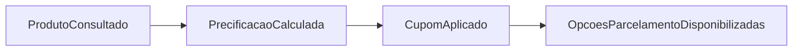
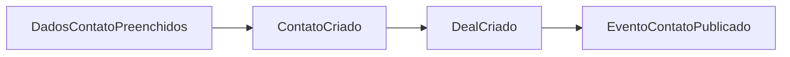
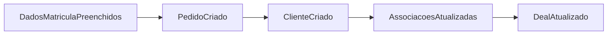
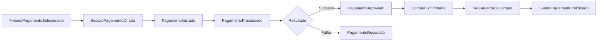
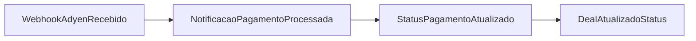
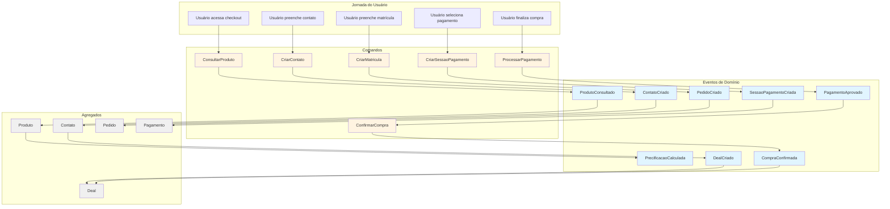
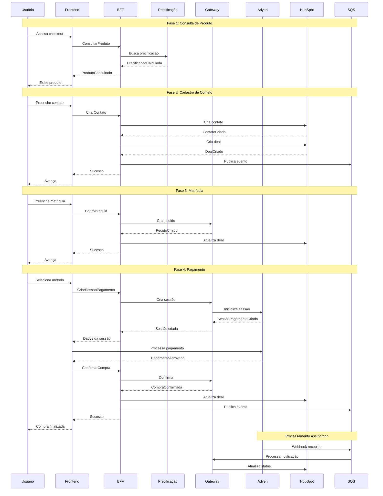
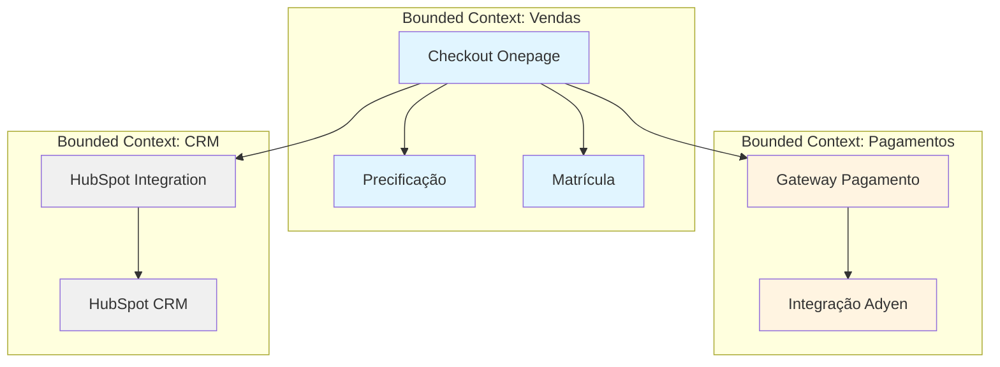

# Event Storming - Checkout Onepage

## Visão Geral

Este documento apresenta o Event Storming do sistema Checkout Onepage, mapeando os eventos de domínio, comandos e agregados que compõem o fluxo de matrícula e pagamento.

## Eventos de Domínio

### Eventos de Produto e Precificação

- **ProdutoConsultado**: Quando o usuário acessa o checkout e o produto é buscado
- **PrecificacaoCalculada**: Após calcular o preço do produto
- **CupomAplicado**: Quando um cupom é aplicado com sucesso
- **OpcoesParcelamentoDisponibilizadas**: Quando as opções de parcelamento são calculadas

### Eventos de Contato

- **DadosContatoPreenchidos**: Usuário preenche formulário de contato
- **ContatoCriado**: Contato criado no HubSpot
- **DealCriado**: Deal (negócio) criado no HubSpot
- **EventoContatoPublicado**: Evento publicado na fila SQS

### Eventos de Matrícula

- **DadosMatriculaPreenchidos**: Usuário preenche dados acadêmicos
- **PedidoCriado**: Pedido criado no Gateway
- **ClienteCriado**: Cliente criado no Gateway
- **AssociacoesAtualizadas**: Associações entre pedido, cliente e produto atualizadas
- **DealAtualizado**: Deal atualizado no HubSpot com informações do pedido

### Eventos de Pagamento

- **MetodoPagamentoSelecionado**: Usuário seleciona método (cartão, PIX, boleto)
- **SessaoPagamentoCriada**: Sessão criada no Adyen
- **PagamentoIniciado**: Processamento iniciado no Adyen
- **PagamentoProcessado**: Adyen processa o pagamento
- **PagamentoAprovado**: Pagamento aprovado com sucesso
- **PagamentoRecusado**: Pagamento recusado
- **CompraConfirmada**: Compra confirmada no sistema
- **DealAtualizadoCompra**: Deal atualizado com status de compra finalizada
- **EventoPagamentoPublicado**: Evento publicado na fila SQS

### Eventos Assíncronos (Webhooks)

- **WebhookAdyenRecebido**: Webhook recebido do Adyen via SQS
- **NotificacaoPagamentoProcessada**: Notificação processada
- **StatusPagamentoAtualizado**: Status atualizado no Gateway
- **DealAtualizadoStatus**: Deal atualizado no HubSpot com novo status

## Diagrama Completo de Event Storming

## Fluxo Temporal de Eventos

## Agregados e Entidades

### Agregado: Produto
- **Raiz**: Produto
- **Eventos**: ProdutoConsultado, PrecificacaoCalculada
- **Comandos**: ConsultarProduto

### Agregado: Contato
- **Raiz**: Contato
- **Eventos**: ContatoCriado, DadosContatoPreenchidos
- **Comandos**: CriarContato

### Agregado: Pedido
- **Raiz**: Pedido
- **Eventos**: PedidoCriado, ClienteCriado, AssociacoesAtualizadas
- **Comandos**: CriarMatricula, CriarPedido

### Agregado: Pagamento
- **Raiz**: Pagamento
- **Eventos**: SessaoPagamentoCriada, PagamentoIniciado, PagamentoAprovado, PagamentoRecusado
- **Comandos**: CriarSessaoPagamento, ProcessarPagamento, ConfirmarCompra

### Agregado: Deal (Negócio)
- **Raiz**: Deal
- **Eventos**: DealCriado, DealAtualizado, DealAtualizadoCompra
- **Comandos**: CriarDeal, AtualizarDeal

## Bounded Contexts

## Regras de Negócio

### Precificação
- Deve calcular preço base do produto
- Deve aplicar cupom se fornecido
- Deve calcular opções de parcelamento
- Deve validar instalações disponíveis

### Contato
- Deve validar dados obrigatórios
- Deve criar contato no HubSpot
- Deve criar deal associado
- Deve publicar evento na fila SQS

### Matrícula
- Deve validar dados acadêmicos
- Deve criar pedido no Gateway
- Deve criar cliente no Gateway
- Deve atualizar deal no HubSpot

### Pagamento
- Deve criar sessão no Adyen
- Deve processar pagamento via SDK
- Deve confirmar compra após aprovação
- Deve atualizar deal com status final
- Deve publicar evento na fila SQS

## Eventos de Integração

### Eventos Publicados (SQS)
- `contact.created` - Contato criado
- `deal.created` - Deal criado
- `payment.processed` - Pagamento processado
- `purchase.confirmed` - Compra confirmada

### Eventos Consumidos (SQS)
- `adyen.webhook.notification` - Webhook do Adyen
- `payment.status.updated` - Status de pagamento atualizado

## Considerações de Design

### Event Sourcing
Alguns eventos críticos são persistidos para auditoria e rastreamento:
- Criação de contatos
- Criação de pedidos
- Processamento de pagamentos
- Confirmação de compras

### CQRS
O sistema utiliza separação entre comandos (write) e queries (read):
- **Commands**: CriarContato, CriarMatricula, ProcessarPagamento
- **Queries**: ConsultarProduto, BuscarPrecificacao

### Saga Pattern
O fluxo de checkout implementa um padrão de saga distribuída:
1. Criar Contato → Criar Deal
2. Criar Pedido → Criar Cliente
3. Criar Sessão → Processar Pagamento → Confirmar Compra

Cada etapa pode ser compensada em caso de falha.
